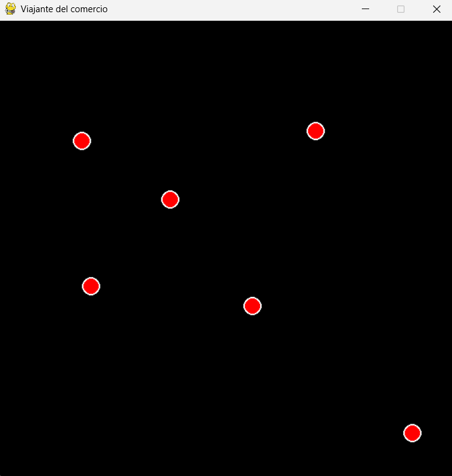
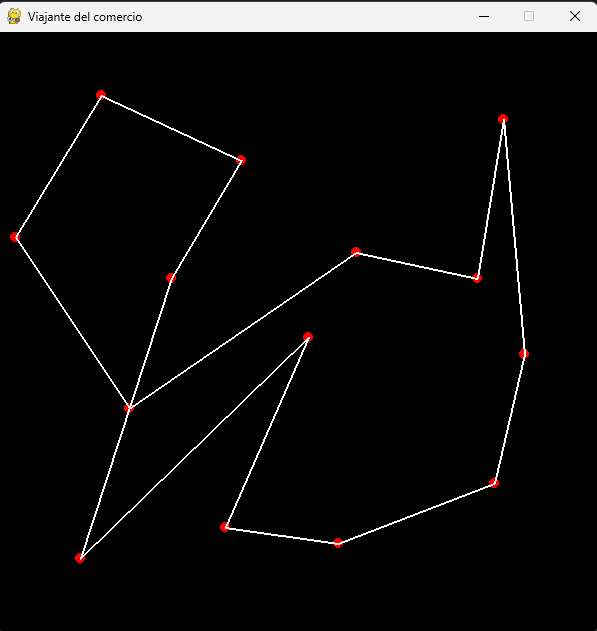

REQUISITOS:

-Tener lanzado la parte de back-end (repositorio "Viajante-comercio")

Para empezar, vamos haciendo click en la pantalla para añadir puntos (que serán nuestras ciudades a visitar).

Cuando hayamos acabado de posicionar todos los puntos, pulsamos enter y:

Se nos construye la ruta encontrada por el algoritmo genético.
